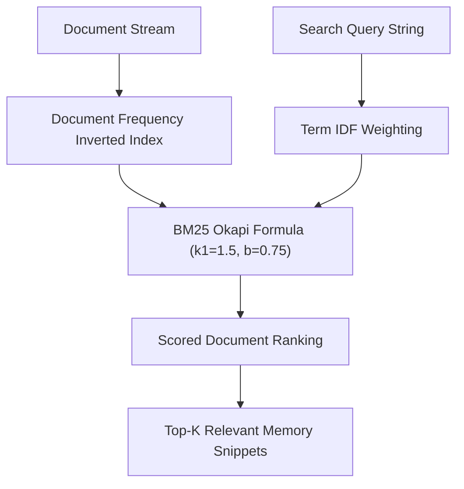

# genpark-bm25-lexical-retrieval-memory-buffer-skill

Agent Skill implementing **Pure Python BM25 Okapi Lexical Memory Retrieval** in 100% Python standard library.

## Architectural Flow

```mermaid
flowchart TD
    Docs["Document Stream"] --> Invert["Document Frequency Inverted Index"]
    Query["Search Query String"] --> TermIDF["Term IDF Weighting"]
    Invert & TermIDF --> Okapi["BM25 Okapi Formula (k1=1.5, b=0.75)"]
    Okapi --> ScoreList["Scored Document Ranking"]
    ScoreList --> TopK["Top-K Relevant Memory Snippets"]
```
